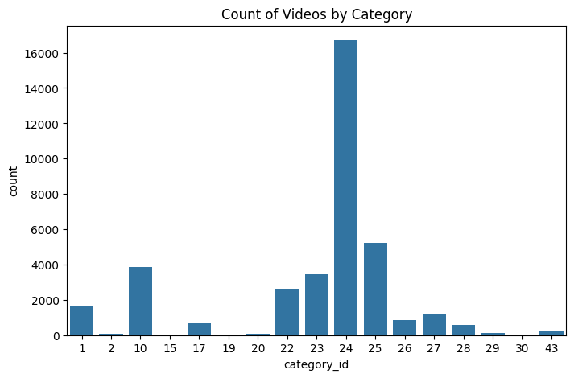
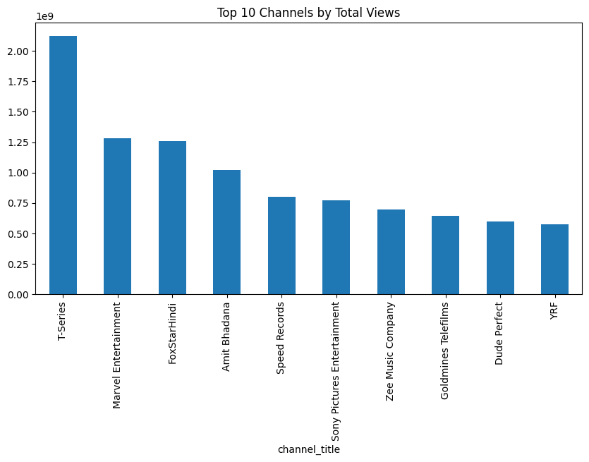
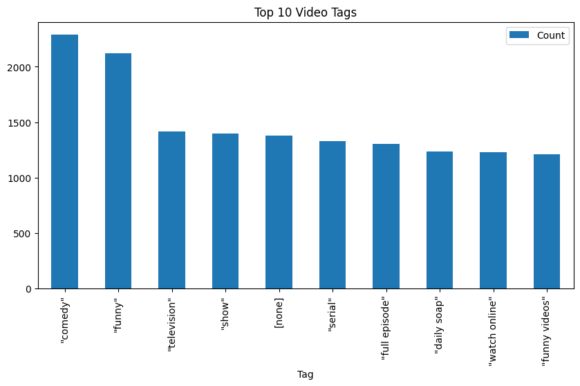
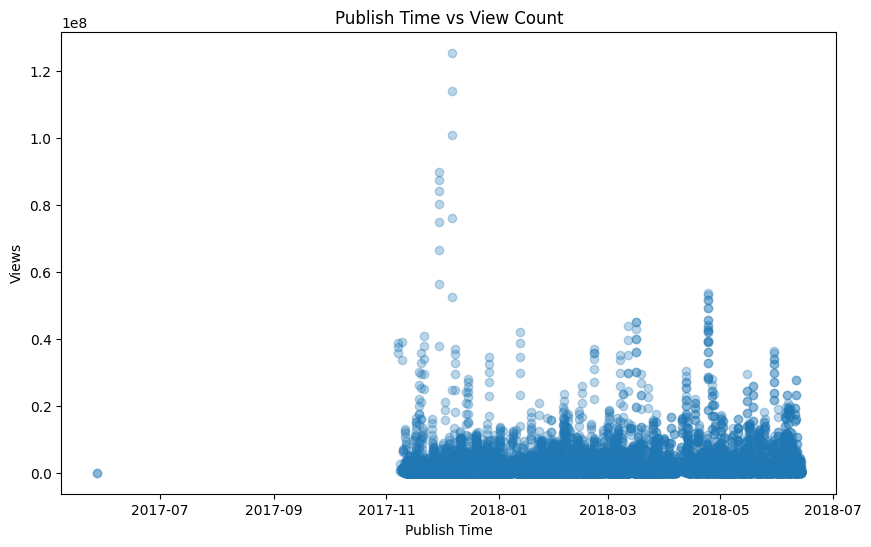
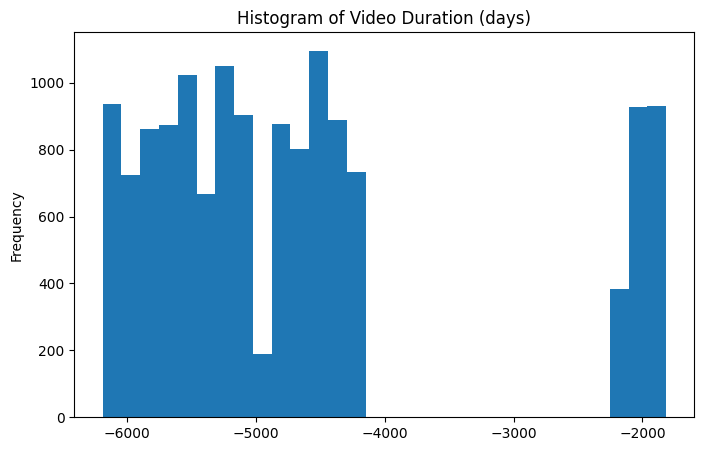
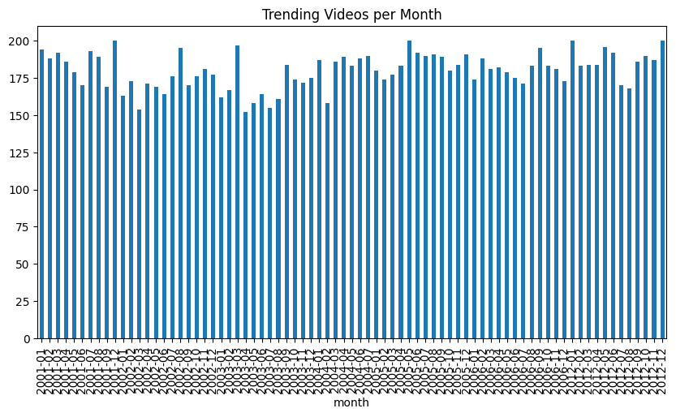

# 📊 Trending YouTube Video Statistics – Data Analysis Project  

## 📌 Overview  
This project analyzes **Trending YouTube Video Statistics (2024)** using **Pandas, NumPy, Matplotlib, Seaborn, and SymPy**.  
The goal is to explore, clean, and transform the dataset while applying **EDA, Feature Engineering, Linear Algebra, and Calculus** concepts.  

---

## 📂 Dataset  
- **Source**: Kaggle / YouTube Trending Dataset (India – 2024).  
- **Format**: CSV file.  
- **Key Columns**:  
  - `video_id`  
  - `title`  
  - `channel_title`  
  - `publish_time`  
  - `tags`  
  - `views`  
  - `likes`  
  - `dislikes`  
  - `comment_count`  
  - `category`  
  - `description`  

---

## 🛠️ Tech Stack  
- **Python 3.10+**  
- **Pandas / NumPy** – Data analysis & linear algebra  
- **Matplotlib / Seaborn** – Visualizations  
- **SymPy / SciPy** – Calculus & statistics  
- **Jupyter Notebook** – Interactive execution  

---

## 📑 Project Tasks  

### Part 1 – Basic Data Understanding  
- Load dataset into Pandas DataFrame  
- View shape, columns, data types  
- Handle missing values & duplicates  
- Summary statistics with `.describe()`  
- Unique values & frequency counts  

### Part 2 – EDA (Exploratory Data Analysis)  
- Count of videos by category  
- Top 10 channels by views  
- Most common tags  
- Publish time vs views scatter plot  
- Video duration histogram  
- Monthly video trends  

### Part 3 – Statistics  
- Mean, median, mode of views  
- Variance & standard deviation of likes  
- % of videos in last 6 months  
- Common category for videos > 1M views  

### Part 4 – Linear Algebra (NumPy)  
- Arrays of views & likes  
- Vector operations & dot products  
- Feature matrix with weights  
- Normalization of view counts  

### Part 5 – Calculus  
- Define popularity score function  
- Derivative wrt views  

### Part 6 – Feature Engineering  
- `days_since_published`  
- `is_high_engagement`  
- `recent_video` flag  
- `tag_count`  
- Quartile rankings  

### Part 7 – SQL Simulation (Pandas)  
- Filter music videos > 1M views  
- Sort videos by views/title  
- Top 5 categories by video count  
- Videos published in 2023  
- Count videos with “India” in title/description  

### Part 8 – Insights  
- Category with most trending videos  
- Month with most trending videos  
- Channel with highest views  
- Most frequent tag  

---
## 📊 Example Visualizations

### Count of Videos by Category


### Top 10 Channels by Total Views


### Most Common Tags


### Publish Time vs View Count


### Video Duration Histogram


### Monthly Video Trends


## 🚀 Getting Started  

### 1️⃣ Clone Repository  
```bash
git clone https://github.com/yourusername/youtube-trending-analysis.git
cd youtube-trending-analysis# Trending-youtube-video-statistics
